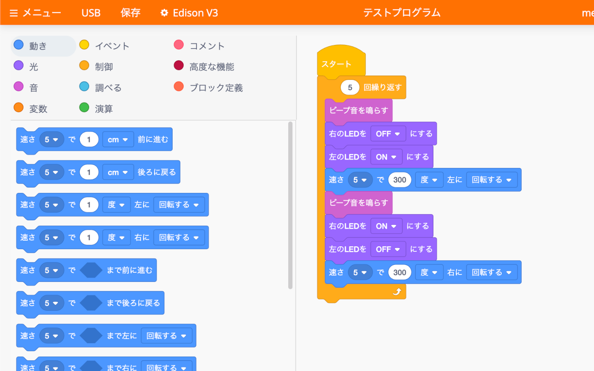

# EdScratch JA_kanji  

## 概要

[EdScratch V3](https://www.edscratchapp.com/v3/)を日本語化するChrome拡張機能のリポジトリです。\
Scratchと相互に移行しやすいように、Scratchに近い翻訳にしています。

## インストール方法

本拡張機能はChromeウェブストアやソースコードからインストールすることができます。\
通常はChromeウェブストアからインストールしてください。\
不具合対策版などをChromeウェブストアでの公開前に使用したい場合は、ソースコードからインストールしてください。

### Chromeウェブストアからインストールする（推奨）

1. [Chromeウェブストア](https://chromewebstore.google.com/detail/lblflnfgopjnhoblchpddniebailongb)で「Chromeに追加」ボタンをクリックして本拡張機能を追加します。

### ソースコードからインストールする

1. [Releases](https://github.com/bonzeboy/edscratchja_kanji/releases)からインストールしたいソースコード（zip）をダウンロードして展開します。
2. 展開したフォルダを、[こちら](https://support.google.com/chrome/a/answer/2714278?hl=JA)の「手順 2: アプリや拡張機能をテストする」に従い、パッケージ化されていない拡張機能として読み込みます。

## 使用方法

本拡張機能をインストールしてから[EdScratch V3](https://www.edscratchapp.com/v3/)を開いてください。

## トラブルシューティング

### [EdScratch V3](https://www.edscratchapp.com/v3/)が正常に動作しない

以下のバッジがpassingでない場合は、正常に動作しない可能性があります。
本拡張機能を一時的に無効化し、passingとなるバージョンがリリースされたら最新版に更新してください。

### [EdScratch V3](https://www.edscratchapp.com/v3/)の一部が翻訳されない

以下については英語のままになっています。これら以外に翻訳されていない箇所があった場合は、翻訳漏れの可能性がありますので、[Issue](https://github.com/bonzeboy/edscratchja_kanji/issues)にてご報告をお願いいたします。
- 「メニュー」＞「ファームウェアを更新する」のステータス表示
- 「メニュー」＞「診断する」の本文
- 「メニュー」＞「EdScratchについて」の本文
- 「メニュー」＞「利用規約」の本文
- 「Edison V3」＞「自分のEdisonのバージョンを確認する」の本文
- 「変数」＞「変数を管理する」で変数を削除後の操作ボタン
- デフォルトのファイル名（Untitled Program）

## 開発者向け情報

### How does it work?
`block_rules.json` replaces two JavaScript files downloaded to the browser as part of the EdScratch application with their translated copies. This translates categories, blocks, and warning/error messages into Japanese.

### How to create your own EdScratch translation plugin
To translate EdScratch into your language:
1. Download the following original JavaScript files:
   - https://www.edscratchapp.com/v3/msg/messages.js
   - https://www.edscratchapp.com/v3/blocks_compressed_vertical.js
2. Search for and translate each piece of text in [EdScratch V3](https://www.edscratchapp.com/v3/) from the `messages.js` and `blocks_compressed_vertical.js` files. The text content is primarily defined in `messages.js`, while `blocks_compressed_vertical.js` handles display methods. In this plugin, the translated files are stored in the v3 directory.
3. Save all translated JavaScript files, open the `block_rules.json` file, and replace the `extensionPath` properties in all rules with the paths to your translated files.
4. Open the `manifest.json` file, update the plugin `name`, `version`, and `description`, and change the `resources` in the `web_accessible_resources` section to match the paths of your translated JavaScript files.
5. Create your own tile and icon images.
